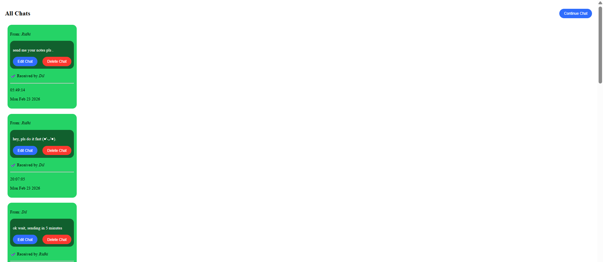
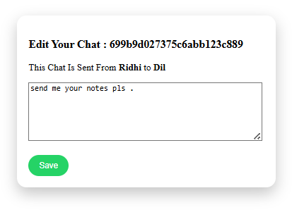
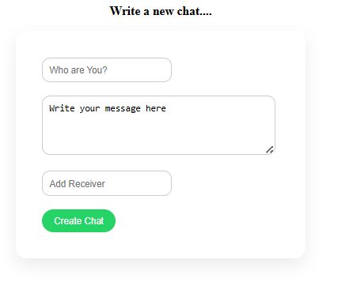

# 📌 Mini WhatsApp Clone

A simple CRUD chat application built using Node.js, Express.js, MongoDB, and EJS.

This project simulates a basic WhatsApp-like interface where users can create, edit, and delete chats.

---

## 🚀 Features

- 📩 Create new chats
- 📜 View all chats
- ✏️ Edit existing messages
- ❌ Delete chats
- 🕒 Timestamp for each message

---

## 🛠️ Tech Stack

- Node.js
- Express.js
- MongoDB
- Mongoose
- EJS (Template Engine)
- CSS

---

## 📂 Project Structure

```bash
models/         → Database schema
views/          → EJS templates
public/         → CSS files
init/           → Sample data script
index.js        → Main server file
```

---

## ⚙️ Installation

### 1️⃣ Clone the repository

```bash
git clone https://github.com/your-username/mini-chat-app.git
```

```bash
cd mini-chat-app
```

---

### 2️⃣ Install dependencies

```bash
npm install
```

---

### 3️⃣ Start MongoDB

Make sure MongoDB is running locally:

```bash
mongodb://127.0.0.1:27017/whatsapp
```

---

### 4️⃣ Run the server

```bash
node index.js
```

---

## 📸 Screenshots

### 🏠 Homepage

<p align="center">
  
</p>

---

### ✏️ Edit Chat Page

<p align="center">
  
</p>

---

### 📩 New Chat Page

<p align="center">
  
</p>

---

## 🌐 Routes

| Route | Method | Description |
|------|------|-------------|
| `/chats` | GET | Show all chats |
| `/chats/new` | GET | New chat form |
| `/chats` | POST | Create chat |
| `/chats/:id/edit` | GET | Edit form |
| `/chats/:id` | PUT | Update chat |
| `/chats/:id` | DELETE | Delete chat |

---

## 🧠 Concepts Practiced

- CRUD Operations
- RESTful Routing
- Express Middleware
- MongoDB Integration
- Mongoose Schema & Models
- EJS Templating
- Method Override
- Form Handling

---

## 👩‍💻 Author

Made with ❤️ by Dilpreet Kaur
